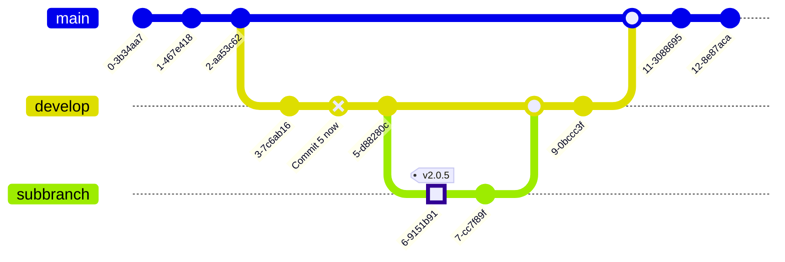

# hello-world
Learning github with official documentation

## Copy Permanentlink

https://github.com/Raju-Praveen/WhatsApp-Clone/blob/b0559e420eac47748bfb1735abb7cee6ac0cae12/home_screen.py?plain=1#L30C1-L37

## Mathematical expression

Expression: $\sqrt{2x+1}+(1+x)^6$

## **Cauchy-Schwarz inequality**

```math
\left( \sum_{i=1}^n a_k b_k\right)^2 \leq \left( \sum_{i=1}^n a_k^2 \right) \left( \sum_{i=1}^n b_k^2 \right)
```

```math
\sqrt{4}
```


### Simple flow chart:

## Mermaid node with text


## Mermaid git graph




## Mermaid Gantt diagram


## Mermaid Sequence diagram


# Changes
## This is the first change
This is done for learning in creating new branch named readme-edits.
[hello](https://google.com)
1. one
2. two
3. three

-    un
-    order
-    list

> Code
[Contribution](./contribute.md)

<picture>
  
</picture>

|Rank|Languages|
|---:|---:|
|1.| Python|
|3.|Java|
|2.|Django|
|4.|Flask|


Footer 1[^1]
Footer multi line [^2]

[^1]: Footer content 1.
[^2]: Footer content with 2 spaces.
  multiple line.

> [!NOTE]
> This is a note sentence.

> [!IMPORTANT]
> This is a important sentence.

> [!WARNING]
> This is a warning sentence.

|Command|Description|
|:---:|:----|
|`re.compile`|It's a regular expression for python|
|`sys.argv`|It gets a command line argument as input in main method|
|`numpy.array`|Numpy array for multi-dimensional array processing|

<details>
<summary>This is a summary for dropdown menu</summary>
  
## Heading 2
````java
  class Main{
    public static void main(String[] args){
      Main main = new Main();
      System.out.println("Hello World");
      main.showName();
    }

    void showName(){
      System.out.println("This is GitHub");
    }
  }
````
</details>

